# lab03-CVDS
# Integrantes 
  Juan miguel Rojas Chaparro 
  Cristian David Silva perilla

## CREAR PROYECTO CON MAVEN

Deben crear un proyecto maven con los siguientes parámetros:
Grupo: edu.eci.cvds 
Artefacto: Library 
Paquete: edu.eci.cvds.tdd 
archetypeArtifactId: maven-archetype-quickstart

creamos el proyecto con el siguiente comando:
mvn archetype:generate -DgroupId=edu.eci.cvds -DartifactId=Library -Dpackage=edu.eci.cvds.tdd -DarchetypeArtifactId=maven-archetype-quickstart -DinteractiveMode=false

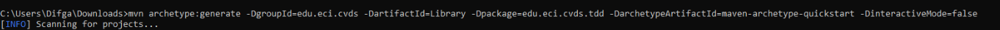

Después de creado nuestro proyecto maven tenemos el siguiente arbol

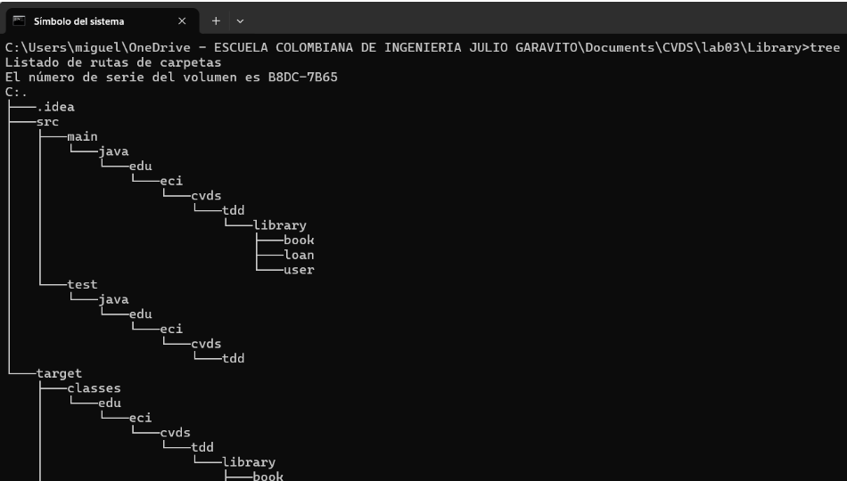

## AGREGAR DEPENDENCIA JUNIT5
Para esta parte se agregan las dependencias de JUNIT con los paquetes en las versiones adecuadas

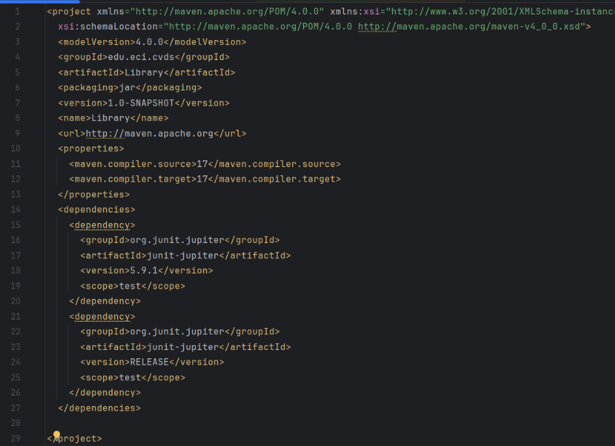

## AGREGAR LAS CLASES Y PAQUETES REQUERIDOS 

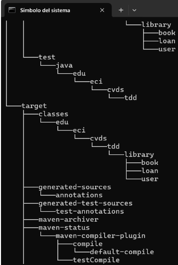

## PRUEBAS UNITARIA Y TDD

para esta parte de las pruebas unitarias es necesario crear nuestro repositorio donde sobre este se van a estar desarrollando 2 ramas en las cuales trabajaremos y verificaremos nuestros test mediante pull request 

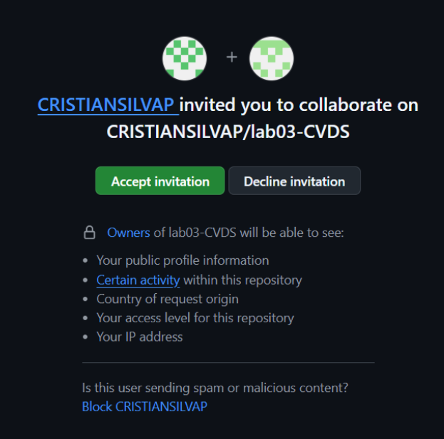
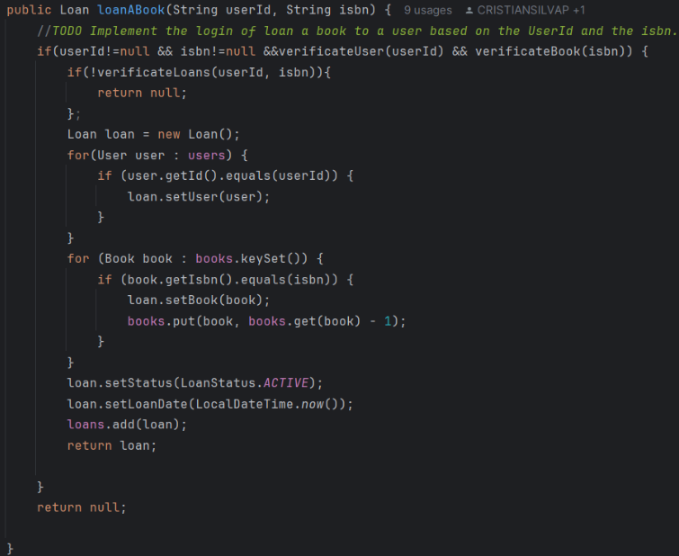

métodos auxiliares para el método loanBook

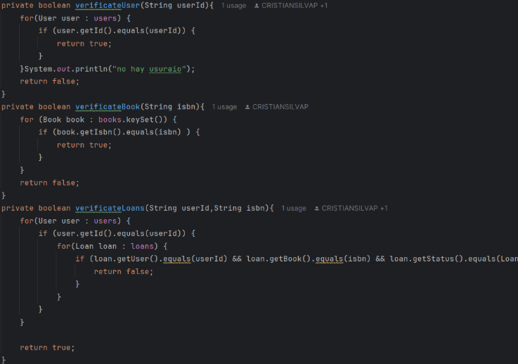
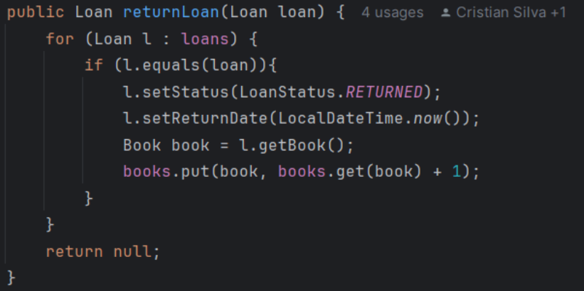

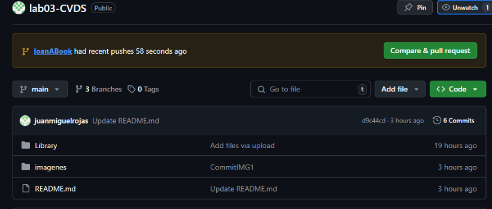
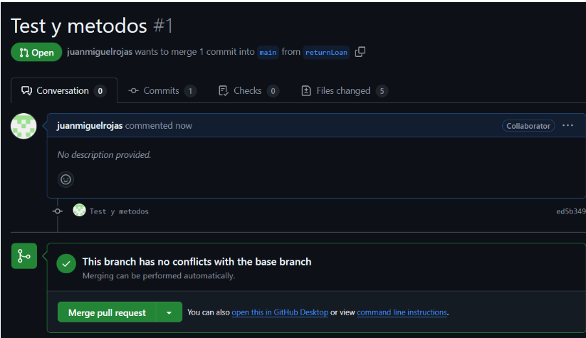
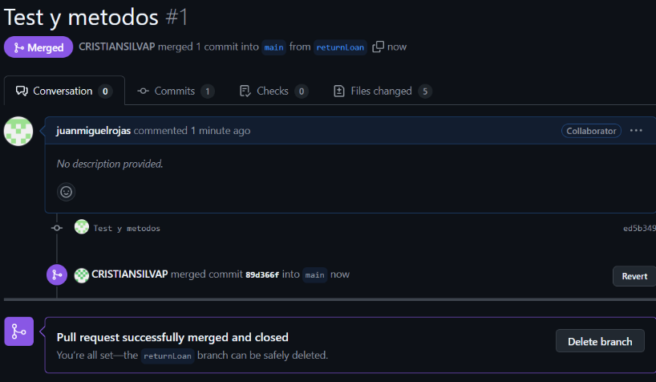
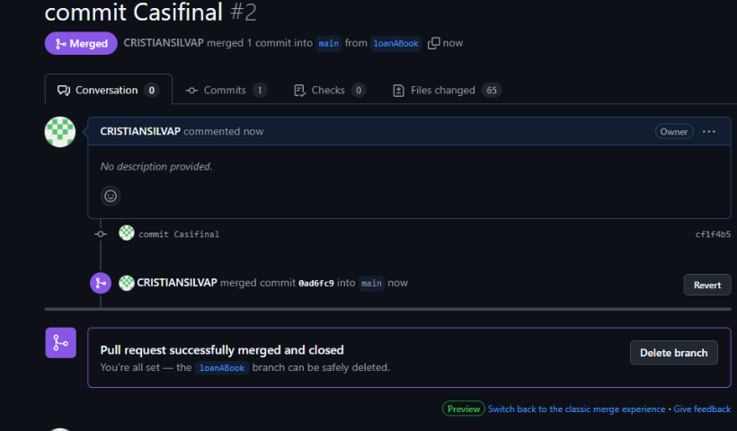

## CREAR LA CLASE DE PRUEBA 

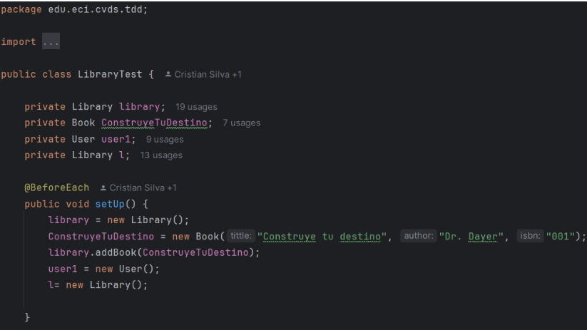
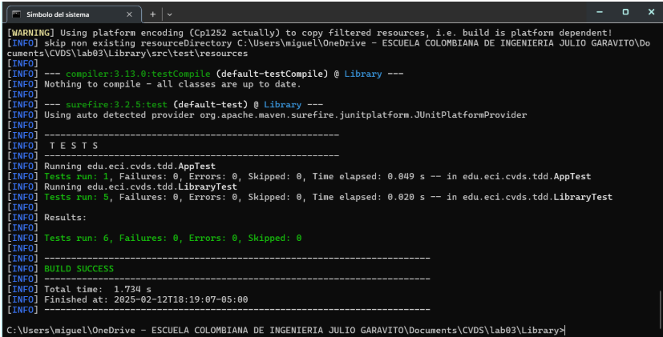
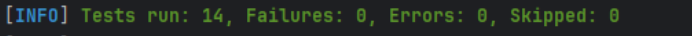

## COBERTURA

Agregar la dependencia de jacoco, utilizar la última versión disponible en maven central.
Para usar Jacoco es necesario agregar la siguiente sección en el pom.xml

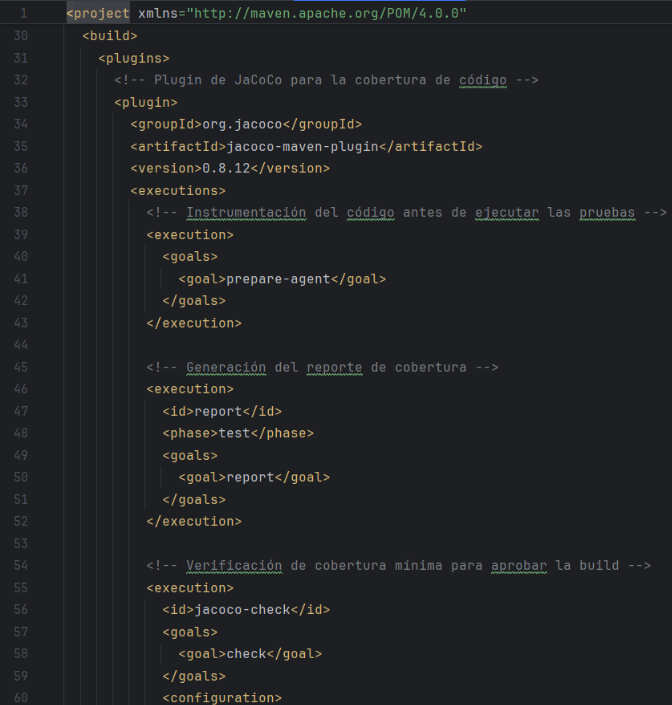
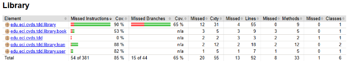

Como se puede observar jacoco nos dice que nuestras prueba tienen más de un 80 por ciento en cobertura teniendo un 90 por ciento para la clase solicitada

SONARQUBE

Ahora es necesario hacer el análisis estático del código usando SonarQube, para lo cual necesitamos tener Docker.
Para lo cual se debe descargar la imagen de docker con el siguiente comando docker pull sonarqube
Ahora se debe arrancar el servicio de SonarQube con el siguiente comando docker run -d --name sonarqube -e SONAR_ES_BOOTSTRAP_CHECKS_DISABLE=true -p 9000:9000 sonarqube:latest
Validar funcionamiento docker ps -a
Iniciar sesión en sonar localhost:9000 cambiar la clave por defecto usuario y contraseña es admin.
Entrar a las opciones de la cuenta.
Account -> settings -> generate token.
Una vez sonar este corriendo deben generar un token
Instale sonarLint en el IDE que esté manejando.
Añada el plugin de Sonar en el archivo pom del proyecto.

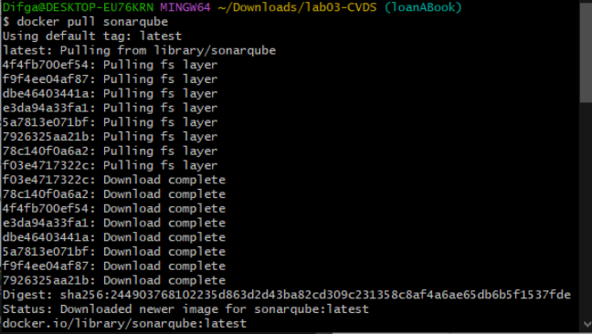
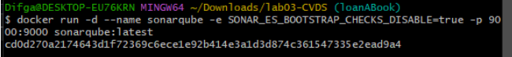
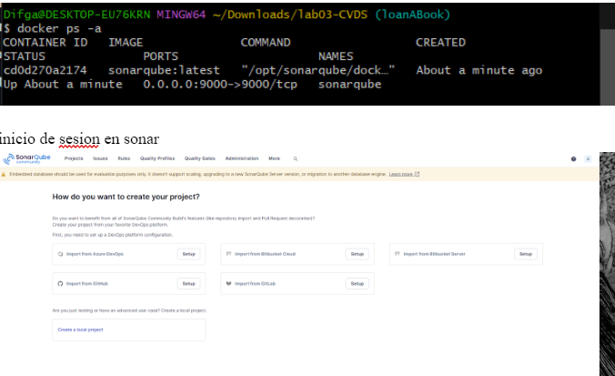
