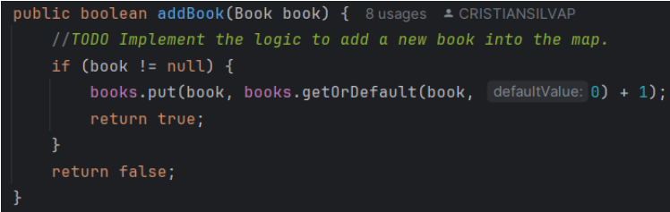

# lab03-CVDS

## CREAR PROYECTO CON MAVEN
Deben crear un proyecto maven con los siguientes parámetros:
Grupo: edu.eci.cvds 
Artefacto: Library 
Paquete: edu.eci.cvds.tdd 
archetypeArtifactId: maven-archetype-quickstart
creamos el proyecto con el siguiente comando:
mvn archetype:generate -DgroupId=edu.eci.cvds -DartifactId=Library -Dpackage=edu.eci.cvds.tdd -DarchetypeArtifactId=maven-archetype-quickstart -DinteractiveMode=false

Después de creado nuestro proyecto maven tenemos el siguiente arbol

## AGREGAR DEPENDENCIA JUNIT5
Para esta parte se agregan las dependencias de JUNIT con los paquetes en las versiones adecuadas

## AGREGAR LAS CLASES Y PAQUETES REQUERIDOS 

## PRUEBAS UNITARIA Y TDD
para esta parte de las pruebas unitarias es necesario crear nuestro repositorio donde sobre este se van a estar desarrollando 2 ramas en las cuales trabajaremos y verificaremos nuestros test mediante pull request 

## CREAR LA CLASE DE PRUEBA 

